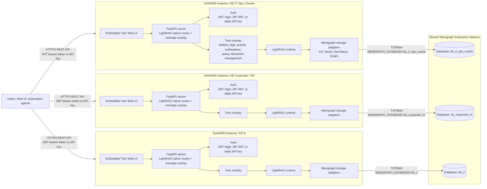

# TwinKMS Architecture

Last updated: 2026-07-07

## Purpose

This document replaces the older Kubernetes/Nexus/Gatekeeper diagram for the
current TwinKMS deployment model.

TwinKMS is now modeled as a set of independent knowledge-base instances. Each
knowledge base is a TwinKMS runtime with its own HTTP API surface, authentication
boundary, LightRAG runtime, Twin overlay, and Web UI. Persistence is centralized
in one shared Memgraph Enterprise instance, with one isolated Memgraph database
per knowledge base.

There is no shared Nexus router, no Gatekeeper, no API Gateway component, no
gRPC data plane, and no service-mesh mTLS layer in this architecture view.

## Current Architecture



ASCII view:

```text
Users / Web UI / automation agents
        |
        | HTTPS REST API
        | Authorization: JWT bearer token or API key
        |
        +------------------------+------------------------+
        |                        |                        |
        v                        v                        v
+-------------------+    +-------------------+    +-------------------+
| TwinKMS Instance  |    | TwinKMS Instance  |    | TwinKMS Instance  |
| KB IT Ops/Oracle  |    | KB Corporate/HR   |    | KB N              |
|                   |    |                   |    |                   |
| Embedded Web UI   |    | Embedded Web UI   |    | Embedded Web UI   |
| FastAPI server    |    | FastAPI server    |    | FastAPI server    |
| Auth checks       |    | Auth checks       |    | Auth checks       |
| LightRAG runtime  |    | LightRAG runtime  |    | LightRAG runtime  |
| Twin /twin/api    |    | Twin /twin/api    |    | Twin /twin/api    |
| Memgraph adapters |    | Memgraph adapters |    | Memgraph adapters |
+---------+---------+    +---------+---------+    +---------+---------+
          |                        |                        |
          | TCP/Bolt               | TCP/Bolt               | TCP/Bolt
          | MEMGRAPH_DATABASE      | MEMGRAPH_DATABASE      | MEMGRAPH_DATABASE
          v                        v                        v
   +---------------------------------------------------------------+
   | Shared Memgraph Enterprise instance                           |
   |                                                               |
   |  +------------------+  +------------------+  +--------------+ |
   |  | Database:        |  | Database:        |  | Database:    | |
   |  | kb_it_ops_oracle |  | kb_corporate_hr  |  | kb_n         | |
   |  +------------------+  +------------------+  +--------------+ |
   |                                                               |
   | Stores: KV, vectors, DocStatus, graph, folder memberships,    |
   | tags, activity, notifications, API keys, quota metadata.       |
   +---------------------------------------------------------------+

No API Gateway. No Gatekeeper. No Nexus/router. No gRPC. No mTLS sidecars.
```

## Deployment Unit

A TwinKMS knowledge base is deployed as one application runtime connected to a
dedicated database inside the shared Memgraph Enterprise instance.

The application runtime contains:

- the FastAPI server;
- LightRAG's native API routes;
- the Twin `/twin/api` overlay;
- the embedded Twin Web UI;
- authentication and authorization checks;
- ingestion, query, document, folder, tag, graph, activity, notification, quota,
  and API-key endpoints;
- the storage adapters that map LightRAG storage contracts to Memgraph.

The shared Memgraph Enterprise instance is the persistence layer for all KBs.
Each KB writes only to its configured Memgraph database. That database stores:

- LightRAG KV data;
- vector embeddings and vector metadata;
- document processing status;
- knowledge graph entities and relationships;
- folder membership edges;
- Web UI tags and tag categories;
- activity events;
- notifications;
- API key metadata;
- quota and operational metadata.

## Access Model

Clients call a TwinKMS instance directly over HTTPS.

Supported authentication modes are:

- JWT bearer tokens issued by local login;
- JWT bearer tokens validated from an IdP/JWKS configuration;
- static API keys for automation clients.

The same HTTP API surface is used by the Web UI and automation clients. There is
no separate API Gateway in this architecture.

## API Surfaces

TwinKMS exposes two API families from the same runtime:

| Surface | Prefix | Purpose |
|---|---|---|
| LightRAG-compatible routes | `/documents`, `/query`, `/health`, `/pipeline_status`, etc. | Native or shimmed LightRAG behavior required by ingestion, query, health, and compatibility flows. |
| Twin overlay routes | `/twin/api/*` | Folder-aware document management, tags, graph CRUD, activity, notifications, settings, quota, and structured query flows. |

The Web UI is served by the same TwinKMS runtime and uses these HTTP APIs.

## Knowledge Base Isolation

Each knowledge base is a TwinKMS application instance backed by its own Memgraph
database inside the shared Memgraph Enterprise instance. KBs are isolated at
application and database boundaries:

- no shared Nexus router;
- no cross-KB gRPC routing;
- no shared Gatekeeper component;
- no shared API Gateway component;
- no TigerGraph or external graph database in this view;
- no outbound connector hub in this view.

Persistence isolation is implemented with distinct Memgraph databases. The
architectural contract is that a KB's documents, vectors, graph, tags, activity,
and operational state are owned by that KB's TwinKMS instance and stored in that
KB's configured Memgraph database.

Inside one TwinKMS instance, folders are logical compartments over that
instance's knowledge base. A document is stored once and can be attached to one
or more folders through `MEMBER_OF` relationships in Memgraph.

## Request Flow

### Document Upload

1. A user or automation client calls `POST /documents/upload` over HTTPS.
2. The TwinKMS runtime authenticates the request using JWT or API key auth.
3. The upload is accepted by the LightRAG-compatible ingestion route.
4. TwinKMS binds the active folder context and optional classification metadata.
5. LightRAG queues and processes the document.
6. TwinKMS storage adapters persist document status, chunks, vectors, graph
   facts, and folder membership in the KB's Memgraph database.
7. The Web UI and clients poll/read the same TwinKMS APIs for status and results.

### Query

1. A user or automation client calls `/query` or `/twin/api/query`.
2. The TwinKMS runtime authenticates the request.
3. The active folder context scopes document and graph retrieval.
4. LightRAG retrieves context from the KB's Memgraph-backed vector and graph
   storage.
5. TwinKMS returns a sourced answer and exposes supporting source metadata
   through its API.

### Administration

Administrative operations use the same HTTP API boundary:

- folder management;
- API key management;
- tag governance;
- document retagging and approval flows;
- graph entity and relation edits;
- quota and operational status reads.

Admin-only routes are checked inside TwinKMS. There is no external Gatekeeper
component in the current model.

## Removed Legacy Components

The older diagram included components that are no longer part of the current
architecture:

| Legacy component | Current state |
|---|---|
| Gatekeeper / OPA policy box | Removed. Auth and admin checks are enforced inside TwinKMS. |
| Nexus Router / semantic router | Removed. Each KB is a TwinKMS instance; clients address the intended instance directly. |
| API Gateway connector hub | Removed from this architecture view. |
| Envoy sidecars | Removed from this architecture view. |
| gRPC links | Removed. The data plane is HTTP REST API. |
| mTLS service mesh | Removed from this architecture view. |
| TigerGraph | Removed. Memgraph is the graph and persistence backend. |
| External systems of record | Out of scope for this closed TwinKMS architecture document. |

## Operational Notes

- The production runtime should run with authentication enabled and fail-closed
  policy when exposed outside a trusted development environment.
- Memgraph connectivity is configured through environment variables such as
  `MEMGRAPH_URI`, `MEMGRAPH_USERNAME`, `MEMGRAPH_PASSWORD`,
  `MEMGRAPH_DATABASE`, and `MEMGRAPH_WORKSPACE`.
- In the target deployment model, `MEMGRAPH_URI` points to the shared Memgraph
  Enterprise instance and `MEMGRAPH_DATABASE` selects the isolated database for
  the current KB.
- Twin overlay activation is controlled by `register()` or by the production
  entrypoint, which enables the Web UI, Twin API overlay, and native route shims.
- The runtime remains LightRAG-compatible: TwinKMS extends and shims LightRAG
  rather than forking it.
